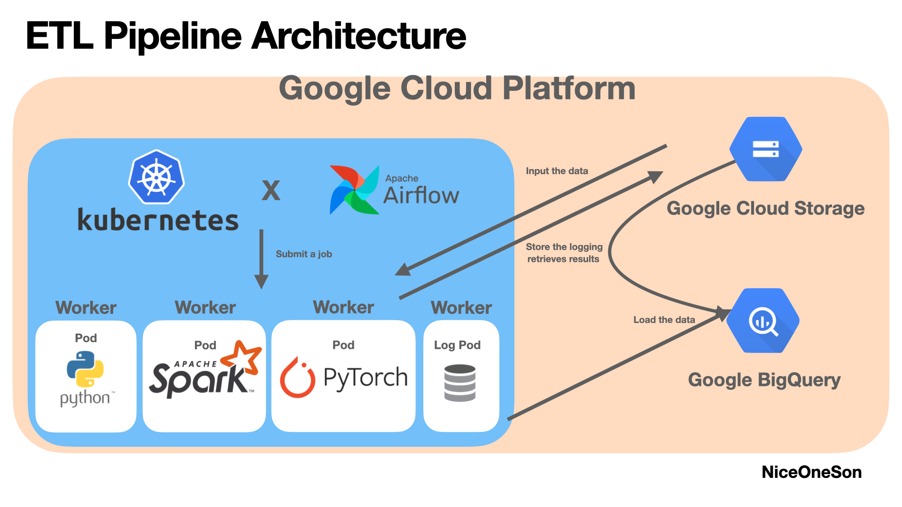

# ETL_DataPipeline_v2

## Purpose of project
Version 2 프로젝트 목표는 Version 1이 가진 효율성 문제를 고민하고 해결하고자 함.\
고려 사항으로는 크게 아래 두 가지가 존재.\
This project is aimed for improving efficiency of The pipeline [ver 1](https://github.com/NiceOneSon/ETL_DataPipeline_ver1). There are two types consideration.

1. 병렬 컴퓨팅(Parallel computing)
- Auto Scaling\
스케일 아웃 방식이 필요함. 이는 기존 Local VM 위 LocalExecutor를 사용한 지난 Version 1 프로젝트는 데이터 파이프라인이 증가함에 따라 문제가 생길 수 있음. [Operator 정리](https://www.notion.so/Operators-eb269379975a48be90f6089a03a8f4ec)를 근거로 KubernetesExecutor와 KubernetesPodOperator를 사용.\
Using a way having scale-out resources(server) to perform the Operators in parallel is needed, instead of such as LocalExecutor which can perform the pipeline on a single VM and multiprocessing. Based on [operators](https://www.notion.so/Operators-eb269379975a48be90f6089a03a8f4ec),KubernetesPodOperator is decided.

- Multi processing\
만일 데이터가 엄청 많다면 해당 operator 실행 시 너무 많은 시간이 걸릴 수 있다고 생각.\
동시성 & 병렬성 제어로 데이터를 가져오는 방법을 고려.\
There is a lot of time should be spent when data pipelines have to deal with much data.\
a parallel and concurrent method are needed in this case.

2. Network Throughput
- Compression Algorithm
- Locality
- Shuffling

3. 여러 개발 환경
언제 셔플링이 발생하고, 어떻게 인식하고, 어떤 방법이 효율적인지를 고려할 것.

## Installation for Airflow cluster.
두 가지를 참고.
1. Airflow Cluster 설치(Install The Airflow cluster)\
[Deploying Airflow on Google Kubernetes Engine with Helm](https://towardsdatascience.com/deploying-airflow-on-google-kubernetes-engine-with-helm-28c3d9f7a26b)

2. yaml 파일 변경(Config yaml files)
- Webserver svc\
helm 초기 webserver 서비스 설정은 ClusterIP로 설정되어 있다.\
Webserver는 외부에서 접근 가능해야하기 때문에 Cluster 내부에서만 접근 가능한 ClusterIP 타입이 아닌 LoadBalancer를 선택. [참고](https://seongjin.me/kubernetes-service-types/)\
A default value of the webserver service's type is 'ClusterIP'. But only the webserver has to be accessed from the outside of a cluster, so the webserver service's type should be changed into 'LoadBalancer'.

- Executor\
helm 초기 Executor 설정은 CeleryExecutor인데 MQ 등 인프라 관리를 하지 않기위해 KubernetesExecutor 방식으로 동작시켜 분산시킬 것임\
A default value of executor is 'CeleryExecutor'. But because this project won't use a way using the Message Queue, so change the executor into 'KubernetesExecutor'.

### GKE 생성
### 

## Architecture of Kubernetes

## Refer
### 1. [[Line] Kubernetes를 이용한 효율적인 데이터 엔지니어링](https://engineering.linecorp.com/ko/blog/data-engineering-with-airflow-k8s-1)

### 2. [[버킷플레이스] Airflow 도입기](https://www.bucketplace.com/post/2021-04-13-%EB%B2%84%ED%82%B7%ED%94%8C%EB%A0%88%EC%9D%B4%EC%8A%A4-airflow-%EB%8F%84%EC%9E%85%EA%B8%B0/)

### 3. [[SOCAR] 데이터 그룹 - Airflow와 함께한 데이터 환경 구축기(feat. Airflow on Kubernetes)](https://tech.socarcorp.kr/data/2021/06/01/data-engineering-with-airflow.html)

### 4. [Deploying Airflow on Google Kubernetes Engine with Helm](https://towardsdatascience.com/deploying-airflow-on-google-kubernetes-engine-with-helm-28c3d9f7a26b)
